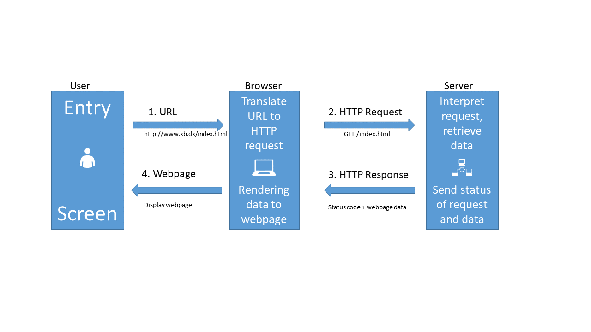
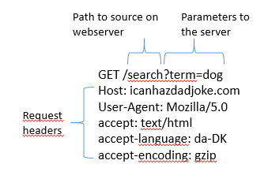
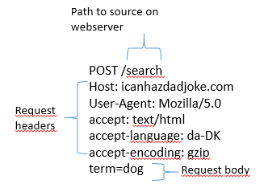

:::::::::::::::::::::::::::::::::::::: questions 

- What is an API?
- How do our computer interact with servers?

::::::::::::::::::::::::::::::::::::::::::::::::

::::::::::::::::::::::::::::::::::::: objectives

- Understand what an API do
- Get to know the two main ways to get data from APIs

::::::::::::::::::::::::::::::::::::::::::::::::

## What is an API?

An API is an Application Programming Interface. It is a way of making
applications, in our case an R-script, able to communicate with another
application typically an online database.

What we want to be able to do, is to let our own application, our
R-script, send a command to a remote application, an online database, in
order to retrieve specific data.

And we want to read the answer we get in return.

This is equivalent to requesting a page from a webserver, something we
have all done.

Webservers and browsers communicate using the HTTP protocol, and the
mechanics of this communication can be visualized like this:

-   When we type in an URL in our browser, it translates that URL to a
    HTTP-request.

-   The browser sends that HTTP-request to a webserver. The request
    contains information about the page we need, but in the "header" of
    the request, there is a lot of other information. The version of
    browser we are using and cookies, to just mention two. The most
    important might be information about what type of response we would
    like.
-   The webserver interpret the request, and retrieves the data.

-   After that, the webserver sends both the status of the request
    (hopefully 200 - which is short for "everything is OK"), and the
    data.

-   The browser receives the data, and displays it as a webpage.

When we are working with APIs we cut out the user. We have a script that
needs some data. We write code that defines, and then send a request til
a server, specifying which data we need. The server extracts the needed
data, and returns it to the script.

## So - how do we do that?

Looking closer at the illustration above, we can see that we send a
request to the server. That request contains several parts.

*The request line.* That contains the method we are using to communicate
with the server, the adress and path of the server, and the information
about the version of HTTP we are using to communicate with the server.

*The header.* Headers are meta information about our request. It
contains information about who we are, the type of browser we are using
and much more.

*The body.* This is really the message that we are sending to the
server. Where the request line tells our computer where to we are
sending our request, and the header provides information about the
request, the body is the actual message we are sending to the server.

The trick is now to make the API understand what data we would like to
get back from it.

## Two types of requests

Two main types of requests are used when communicating with APIs, and
they primarily concerns how we tell the API what data we would like.

In a *GET* request, we encode what we would like returned in the URL.
You probably know that way already.

The URL "<https://icanhazdadjoke.com/search?term=dog>" is asking the
server to search for the term "dog". What we are searching for, is
placed directly in the URL.

What we are sending to the server looks like this:

In a *POST* request, that information is stored in the body of the
request.

That looks like this:

Note that the main difference between these two sets of headers, besides
the difference in GET and POST, is that there is a *body* in the POST
version. This is where the actual search is placed, rather than in the
URL.

Almost all APIs support one or both of these methods.

The GET method is intuitively easy to understand, and it is relatively
easy to edit the URL to search for something else. On the other hand
there are limitations to what we can search for. Everything must be
text, and there are limitations on the length of the search as well.

The POST method allow us to search for arbitrarily many parameters, and
can handle many different data types - because we can put almost any
kind of data into the body part of the request. The POST method is also
more secure, because the body can be encrypted during transport from our
computer to the server. This is also the method we need to use should
the API require a login.

::::::::::::::::::::::::::::::::::::: keypoints 

- Getting data from an API is equivalent to requesting a webpage
- GET requests specify what data we want to retrieve in the URL
- POST requests specify what data we want to retrieve in the body of the request.
- Both requests have headers that we can manipulate to get what we want.

::::::::::::::::::::::::::::::::::::::::::::::::

